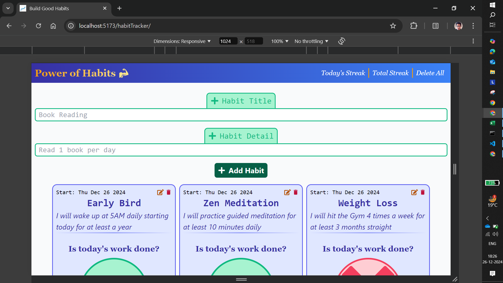
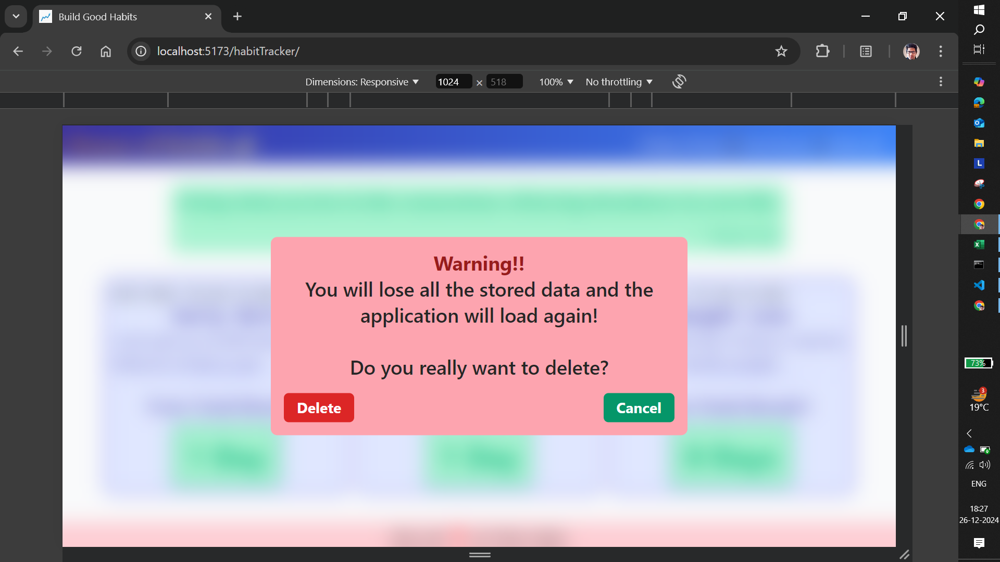
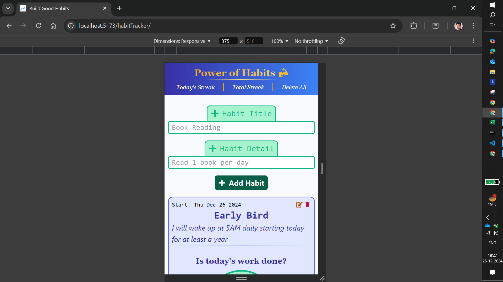
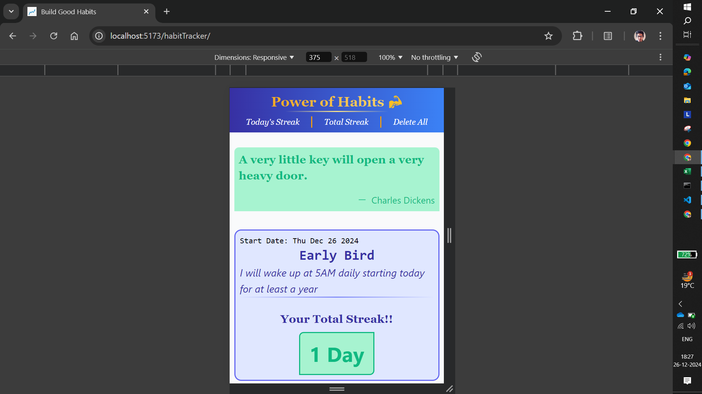

# Habit Tracker

**Habit Tracker** is a powerful and intuitive React application built with Vite, designed to help users build, track, and maintain positive habits. With features like *Daily Streak Tracking*, *Habit Descriptions*, *Starting Dates*, and *Persistent Data Storage*, this app makes habit-building both engaging and effective.

## Features

- **Fixed Navigation Bar**

  - Non-scrollable navigation bar containing the app logo and navigation buttons for easy access.
  - Includes a *Delete All* button to clear all habits and reset the app

- **Delete All Functionality**

  - Clicking *Delete All* opens a confirmation modal
  - If confirmed, all data in the *Local Storage* related to the App is deleted, and the app reloads to its initial state

- **Dynamic Main Display**

  - Main display dynamically updates based on the navigation buttons
  - By default, the *Today's Streak* section is displayed

- **"Today's Streak" Section**

  - Add new habits by providing a *Habit Title* and *Habit Details*
  - If a habit title or detail is left empty, a *Warning Modal* appears for 3 seconds
  - View all added habits along with their descriptions
  - Mark habits as completed for the day using a toggle button
    - **Cross Mark (default state)** -> Indicates the task is not done
    - **Tick Mark** -> Indicates the task is completed
  - Toggle functionality ensures easy tracking of daily tasks

- **Starting Date**

  - Each habit card displays the starting date when the habit was added, enabling users to track their progress

- **Daily Reset**

  - All habits reset to "Not Done" (Cross Mark) at the start of a new day

- **Total Streak Section**

  - Displays the cumulative number of days each habit was completed

- **Persistent Data**:

  - All data, including *Habit Titles*, *Habit Details*, *Streaks*, and *Starting Dates* are stored in the browser's *Local Storage*
  - Data persists even after refreshing or closing the application

- **User-Friendly and Engaging Design**:
  - The interface has been revamped with colorful and engaging visuals to improve user experience
  - Works seamlessly across all devices, including *Mobile Phones*, *Tablets*, and *Desktops*

## Tech Stacks

- **Frontend**: ReactJS with Vite for fast and efficient development
- **Styling**: Tailwind CSS for a clean and responsive design
- **Storage**: Browser Local Storage for data persistence

## Installation and Setup

- **Clone Repository**:

```javascript
git clone https://github.com/prithvish774848474/habitTracker.git
cd habit-tracker
```

- **Install Dependencies**: `npm install`
- **Run the App**: `npm run dev`

## Usage

- Launch the app and use the fixed navigation bar to switch between sections
- Add habits with descriptive titles and details in the *Today's Streak* section
- Track your daily habit completion using the toggle buttons
- View *Total Streaks* and starting dates for each habit in the Total Streak section
- Use the *Delete All* button if you want to reset your progress and start fresh

## Application Interface










## Acknowledgements

- **ReactJS Documentation**: [ReactJS](https://react.dev/learn)
- **Tailwind CSS Documentation**: [TailwindCSS](https://tailwindcss.com/docs/installation)
