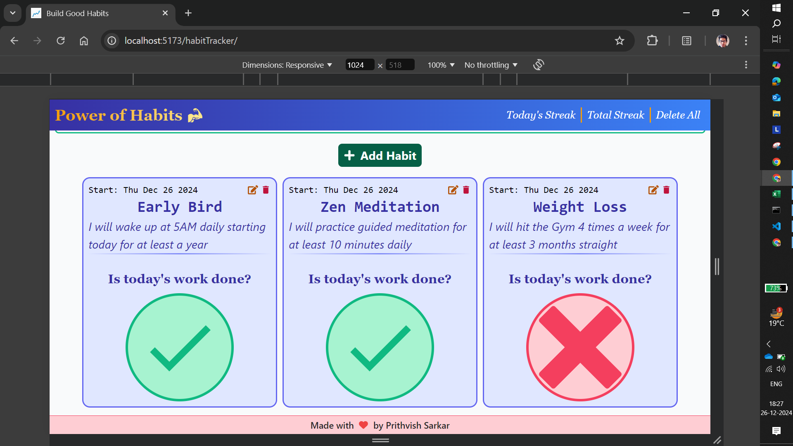
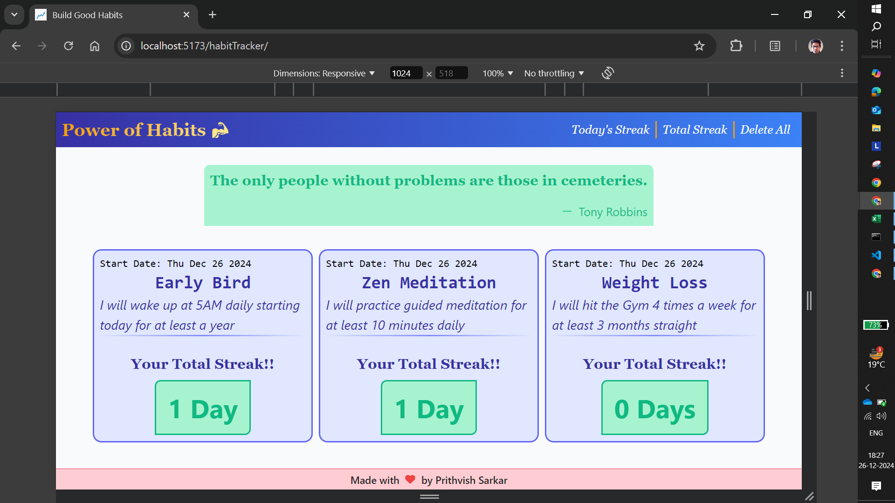

# Habit Tracker

**Habit Tracker** is a React application built using Vite, designed to help users build and maintain new habits. With features like daily streak tracking, habit descriptions, and persistent local storage, this app is a great tool for fostering positive routines.

## Application Interface






## Features

- **Fixed Navigation Bar**:

  - Non-scrollable navigation bar containing the app logo and navigation buttons for easy access.

- **Dynamic Main Display**:

  - The main display re-renders based on navigation button clicks.
  - By default, the "Today's Streak" section is displayed.

- **"Today's Streak" Section**:

  - Add new habits by providing a "Habit Title" and "Habit Details".
  - View all added habits along with their descriptions.
  - Mark habits as completed for the day using a toggle button:
    - **Cross Mark (default state)** -> Indicates the task is not done.
    - **Tick Mark** -> Indicates the task is completed.
  - Toggle functionality ensures easy tracking of daily tasks.

- **Daily Reset**:

  - At the start of each day, all habits reset to the "Not Done" state (Cross Mark).

- **Total Streak Section**:

  - Displays the number of days a habit was marked as completed.

- **Persistent Data**:

  - All data, including habit names, descriptions, and streak counts, are stored in the browser's local storage.
  - Data persists even after refreshing or closing the app.

- **User-Friendly Design**:
  - Simplistic and intuitive interface suitable for users aiming to develop good habits.
  - The application is highly responsive and can be used accross all devices.

## Tech Stacks

- **Frontend**: ReactJS with Vite for fast development
- **Styling**: Tailwind CSS
- **Storage**: Browser Local Storage

## Installation and Setup

- **Clone Repository**:

```javascript
git clone https://github.com/prithvish774848474/habitTracker.git
cd habit-tracker
```

- **Install Dependencies**: `npm install`
- **Run the App**: `npm run dev`

## Usage

- Launch the app and navigate using the fixed navigation bar.
- Add habits with descriptive titles and track their daily completion.
- View your habit streaks in the **Total Streak** section.
- Come back every day to update your progress!
